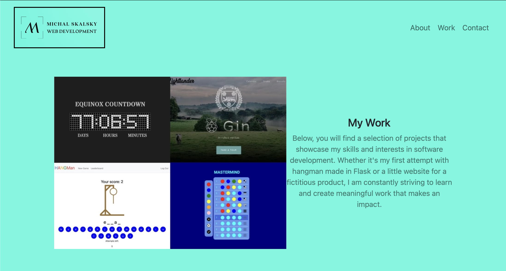

# Bootstrap-Portfolio

The goal of this challenge was to recreate  my portfolio using Bootstrap and minimize the use of media queries.

## Implementation
I've recreated my portfolio website with Bootstrap. It looks very similar to the previous one. I've changed the images and logo and listed some new projects but the layout is more or less the same with a one difference - no media queries this time because Bootstrap is looking after that.

I look forward to adding some interactivity to the website with JavaScript in due course.

The website can be found here: http://michalous.github.io/Bootstrap-Portfolio/